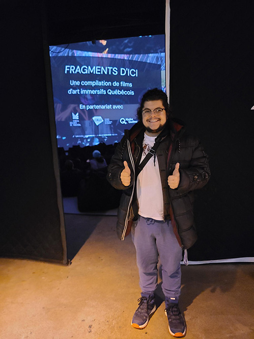
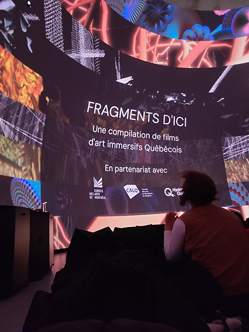
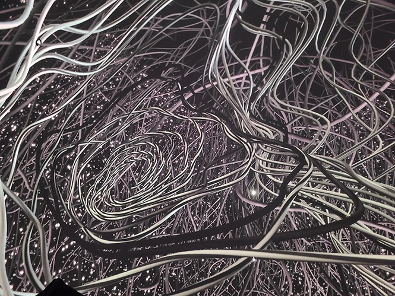
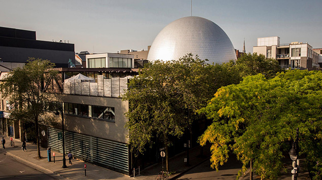
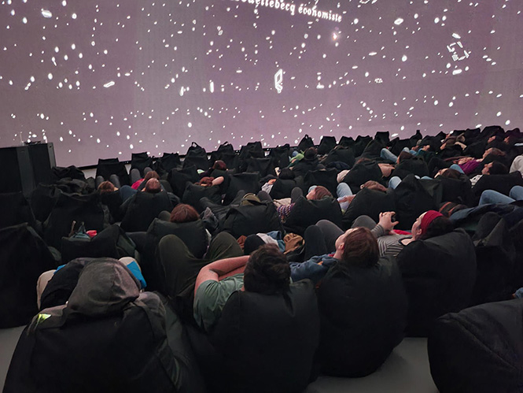
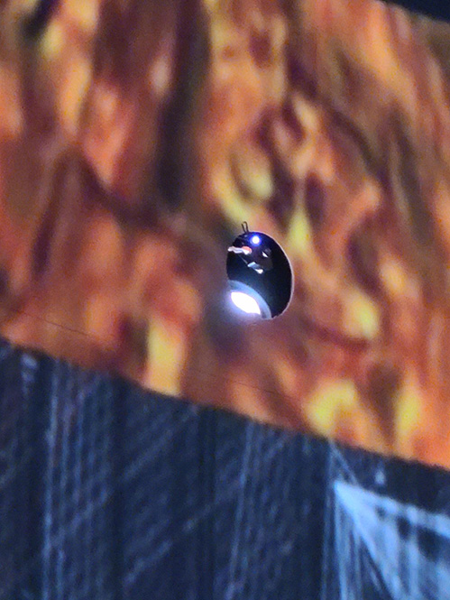
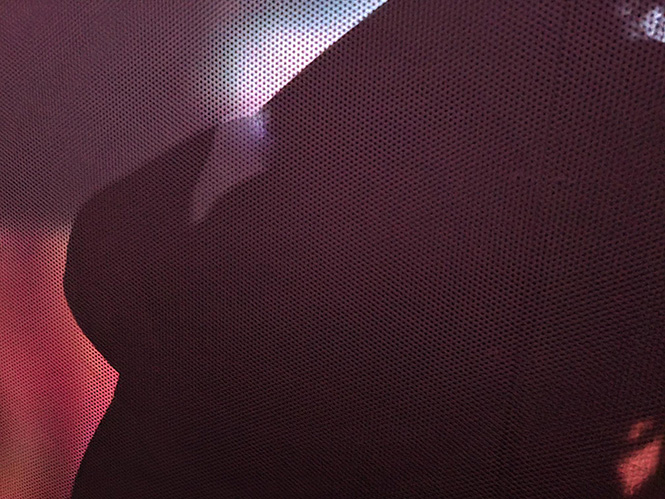
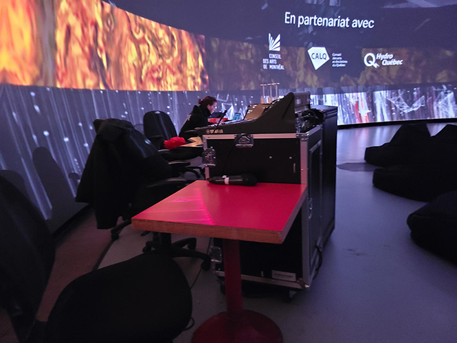
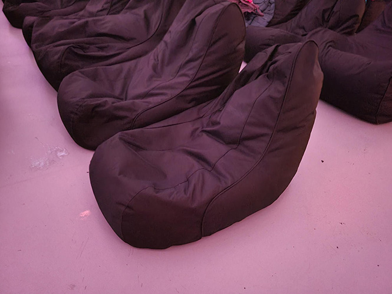

# Visite individuelle

   
  <i>Moi photo prise par Ariane Lanctôt</i>

## FRAGMENTS D'ICI

   
  <i>Titre photo prise par moi</i>

Cette exposition à été active du 28 janvier 2025 au 27 février 2025.
Ce dispositif multimédia à été conçu d'un programme de sept films d'art immersifs pour une durée total de 42 minutes. Les artistes ont eux comme but de créer une immersion et l'exploration des limites de la perception. 

Les septs films :
- Trajectoires interrompus et autres modèles de déséquilibre transitoire
- Mystic value
- Lignes de fuite
- Tree of life
- Immortelle
- Welraumbahn
- Inwardness

#### [Site](https://sat.qc.ca/fr/evenements/fragments-dici)

## L'oeuvre

   
  <i>Image du film Immortelle photo prise par moi</i>

Dans toutes les films, il y avait une différence qui rend le film unique. Par exemple, il y a des films que la caméra avançait et d'autre reculait. Donc on avait des sentiments différents pour chaque film.
Dans l'image au dessus la caméra reculait et ça donnait une sensation de tomber en se mélangeait avec des fils.

## Placement

   
  <i>Batiment de société des arts et technologiques photo prise par moi</i>

Ce dispositif est situé dans le dôme en haut de l'établissement de la société des arts technologiques. 

## Mise en place

Il faut:

Des composanstes  fornies par L'artiste:
- La vidéo
- La musique

Des composantes fourni par la place:
- Le dôme
- les câbles d'alimentations
- Les hauts parleurs
- 8 projecteurs
- Les caches fils
- Une console
- Des coussins

Quand-t-on rentre à l'intérieur du dôme, on apperçoit des coussins installés pour qu'on regarde le plafond. La spécialité du dôme était que toute l'écrans prenait l'entièreté de la surface.

   
  <i>Expérience véçu photo prise par moi</i>

Dans le dôme, il y a 8 projecteurs dans la salle et le mur est plein de petits hauts parleurs. Le tout contrôlé par une console sur le côté. 

Projecteurs | Hauts parleurs
:-------------------------:|:---------------------------:
|
Console | Coussins
|

## Expérience vécue

Personellement j'aurai aimé qu'elle soit disponible à l'année longue. Je n'ai pas vue passé les 42 minutes de la présentation et les films était très original. Les coussins étaient confortable et le volume du son était juste parfait, pas trop fort et pas trop faible. J'ai été surpris que le movement de caméra m'a pas donné mal au coeur. Donc, les movements de caméra était pas trop vite. 

Si cette exposition revient de vous conseille d'y aller.

## Source

   
  <i>Expérience véçu photo prise par moi</i>

