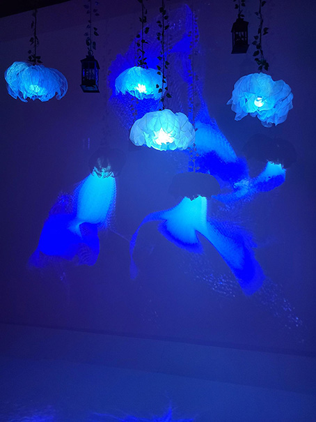

# Resonance : Exposition multimédias des finnissants de la *Technique Intégration Multimédias*
- Où: Collège Montmorency
- Type d'exposition: Exposition temporaire
- Date de visite: le 18 mars

  

*Photo prise par moi*

## Luminatura

## Les créateurs :
- Créé par : Audrey Dandurand, Justine Rousseau, Camilia Bouatmani, Prethiah Rajaratnam, Ihab Mouhajer
- #### [Leur intention](https://miaou-mafia.github.io/projet-luminatura/#/20_intention/)

### Description
Ce dispositif multimédias est composé de trois piédestals qui au contact de la main crée un spectacle de couleurs. Les couleurs varie selon quel piédestal que l'on touche et aussi le nombre qu'on touche en même temps. 

bleu | blanc
:-------------------------:|:-------------------------:
|
jaune | mauve
|

### Type d'installe : 
Immersive et interactive avec les couleurs et les sons quand nous touchons au piédestal.

### Fonctionnement du dispositif :
Les piédestals réagissent à un contact de la mains de l'utilisateur.
Point de vue | Teste
:-------------------------:|:-------------------------:
|
Couleur | Réaction
|

### Mise en place : 

  

Trois piédestals sont installés devant le dispositif. Chaque piédestal ressemble à ça : 

  

Au plafond il y a aussi un structure : 

  

### Composition :
- Des projecteurs
- Plaques en aciers
- Des haut-parleurs
- Des fleurs
- Câble (HDMI, Ethernet, audio)
- Un ordinateur
- Tissu et fils de métal
- Deux lanternes
- Trois fleurs (tissus blanc et jaune ainsi que des fils métalliques)
  Câble métallique en acier inoxydable
- Serre-câbles
- Trois poteaux
- Six clamps doubles Pro Burger
- Une plaque en acier
- Un minicontrôleur Atom M5
- Trois résisteurs
- 2 supports imprimés en 3D
- [Maquette](https://www.youtube.com/watch?v=vc4ROoVuDpA)

### Disposition :

*Vue de face*

*Vue de haut*

*Vue de coter*

*Shéma du dispositif, photo faite par l'équipe du dipositif*

### Ce que j'ai le plus aimé :

J'ai adoré l'idée et le visuel me donnait le goût d'essayer ce dispositif. Ça me donne des idées de travailler avec des couleurs et avec le son en particulié, car ça rend le projet beaucoup plus immersif et plus agréable au sens. J'ai aimé aussi que même si le dispositif était gros, il était compacte. Il prennait la place qu'il faut sans trop en prendre.

### Ce que j'ai moins aimé :

J'ai moins aimé le fait que nous avons pas tout les couleurs à disponibiliter pour l'expérience. Aussi j'aurai aimé que l'ambience change plus drastiquement comme le rouge aille une ambience plus 'Dark' pour faire un contraste.

#### Référence : 

[Luminatura](https://miaou-mafia.github.io/projet-luminatura/#/)
