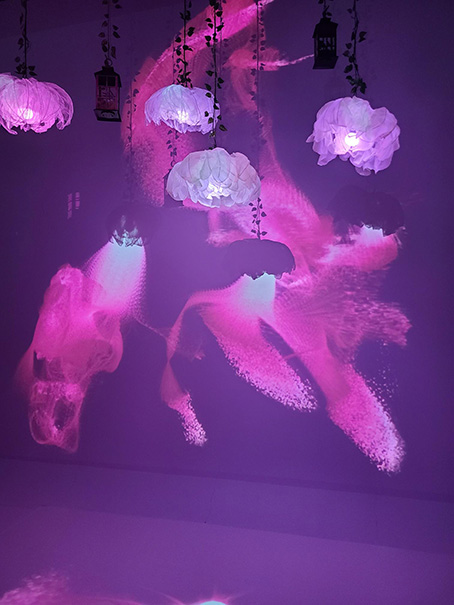
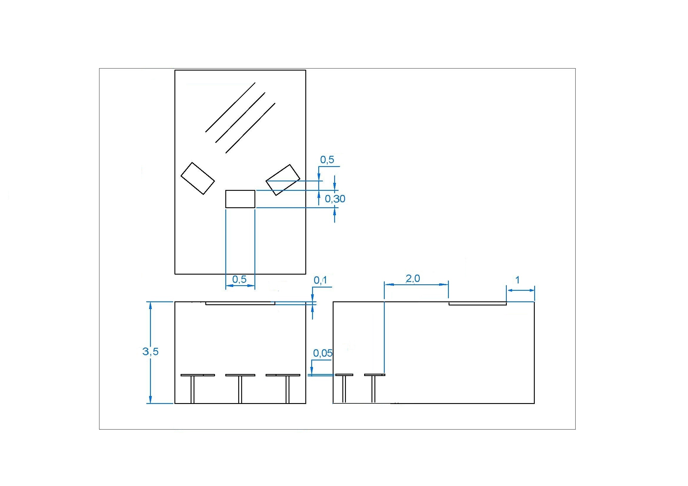

# resonance 
- Où: Collège Montmorency
- Type d'exposition: Exposition temporaire
- Date de visite: le 18 mars

  

*Photo prise par moi*

## Luminatura

## Les créateurs :
- Créé par : Audrey Dandurand, Justine Rousseau, Camilia Bouatmani, Prethiah Rajaratnam, Ihab Mouhajer
- #### [Leur intention](https://miaou-mafia.github.io/projet-luminatura/#/20_intention/)

### Description
Ce dispositif multimédias est composé de trois piédestals qui au contact de la main crée un spectacle de couleurs. Les couleurs varie selon quel piédestal que l'on touche et aussi le nombre qu'on touche en même temps. 

bleu | blanc
:-------------------------:|:-------------------------:
|
jaune | mauve
|

### Type d'installe : 
Immersive et interactive avec les couleurs et les sons quand nous touchons au piédestal.

### Fonctionnement du dispositif :
Les piédestals réagissent à un contact de la mains de l'utilisateur.
Point de vue | Teste
:-------------------------:|:-------------------------:
|
Couleur | Réaction
|

### Mise en place : 

  

Trois piédestals sont installés devant le dispositif. Chaque piédestal ressemble à ça : 

  

### Composition :
- Des projecteurs
- Plaques en aciers
- Des haut-parleurs
- Des fleurs
- Câble (HDMI, Ethernet, audio)
- Un ordinateur
- Tissu et fils de métal
- [Maquette](https://www.youtube.com/watch?v=vc4ROoVuDpA)

### Disposition :

*Vue de face*

*Vue de haut*

*Vue de coter*

*Shéma du dispositif, photo faite par l'équipe du dipositif*

### Ressenti personnel :
J'ai adoré ce dispostif! Le fait que ça sois un spectacle de couleur que nous contrôlons et aussi le fait que pour faire apparaître certaines couleurs fallait être plusieurs a touchers aux plaques intéractives.

---
