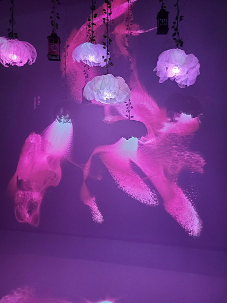
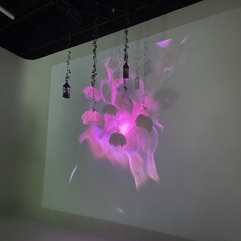
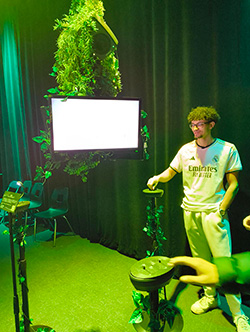

# Exposition des finissants de la technique d'intégration multimédias

  

*Olivier et moi, photo prise par Efraïm*

---

# [Resonance](https://tim-montmorency.com/2025/#/)

  

*Affiche de l'exposition Resonance, photo prise par Olivier*
Deu 17 au 21 Mars

## Les dispositifs multimédias à disposition
- [Prismatica](https://pootpookies.github.io/Prismatica/#/)
- [CON DU8](https://gearshift-games.github.io/Web-C0N-DU8/#/)
- [Luminatura](https://miaou-mafia.github.io/projet-luminatura/#/)
- [Etheria](https://ethereal-creators.github.io/Etheria/#/)
- [Fuga](https://escapism-fuga.github.io/Fuga/#/)
- [Internature](https://tprangers.github.io/internature/#/)
- [Arcadia](https://cousi-cousa.github.io/Arcadia/#/)

---

## Luminatura

  

### Les créateurs :
- Créé par : Audrey Dandurand, Justine Rousseau, Camilia Bouatmani, Prethiah Rajaratnam, Ihab Mouhajer
- #### [Leur intention](https://miaou-mafia.github.io/projet-luminatura/#/20_intention/)

### Description : 
Ce dispositif multimédias à comme but de faire vivre un spectacle de couleur contrôler par l'utilisateur.

### Composition :
- Des projecteurs
- Plaques en aciers
- Des haut-parleurs
- Des fleurs
- Câble (HDMI, Ethernet, audio)
- Un ordinateur
- Tissu et fils de métal
- [Maquette](https://www.youtube.com/watch?v=vc4ROoVuDpA)

### Disposition :

vue de face | vue de haut
:-------------------------:|:-------------------------:
|
*Shéma du dispositif, photo faite par l'équipe du dipositif*

### Ressenti personnel :
J'ai adoré ce dispostif! Le fait que ça sois un spectacle de couleur que nous contrôlons et aussi le fait que pour faire apparaître certaines couleurs fallait être plusieurs a touchers aux plaques intéractives.

---

## Fuga

  

### Les créateurs :
- Créé par : Matis Labelle, Tristan Khadka Abdel, Daniel Dezemma, Ali Djeral, Yavuz-Selim Gucluer
- #### [Leur intention](https://www.youtube.com/watch?v=rhUf4A05L-w)

### Description : 
Ce dispositif multimédias à comme but de faire créer un arbre personnalisé pour chaque utilisateur. Plus on intéragie avec le disositif, plus l'arbre évolue.

### Composition :
- Générateur de fréquence
- Trois télévisions
- Deux haut-parleurs
- Décor recyclé
- Câble (HDMI, Ethernet, audio)
- Projecteur
[Maquette](https://www.youtube.com/watch?v=vc4ROoVuDpA)

### Disposition :

||
*Shéma du dispositif, photo faite par l'équipe du dipositif*

### Ressenti personnel :
J'ai beaucoup aimé l'expérience qui offre avec leur dispositif multimédias. Je trouvais belle aussi l'idée de construire des arbres personnalisé. 
