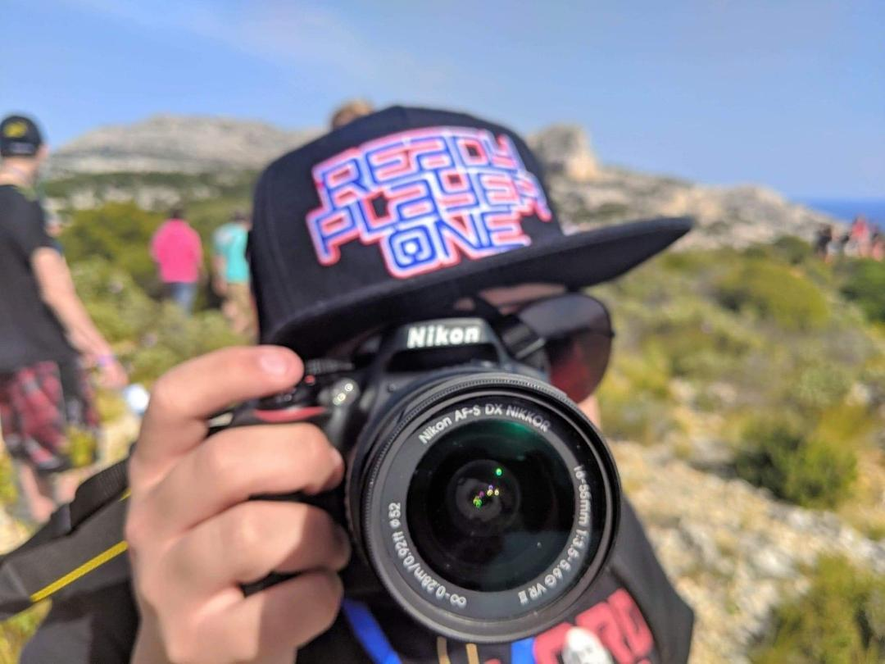

# Cédric Sirois-Tanguay

Depuis tout jeune, je suis passionné par la photographie. À peine arrivé à l'âge de 6 ans, mon père a mit une caméra dans mes mains et m'a fait découvrir ça passion.

Pendant la majorité de mon secondaire, j'ai fais des cours d'art multimédias et j'ai fais de nombreux projets comme celui-ci:

###### **Dans ce projet, j'ai pris les photos de mes camarades de classes et des photos de fumer pour fabriquer une publicité contre le vapotage chez les jeunes.**

## Fun fact

J'adore écouter cette [chaine](https://www.youtube.com/watch?v=jfKfPfyJRdk) youtube pour faire des travaux ou pour devoir me concentrer sur ce que je dois faire.
