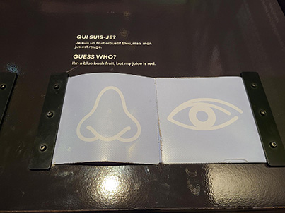
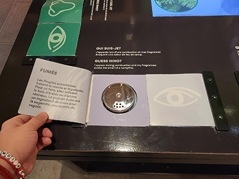
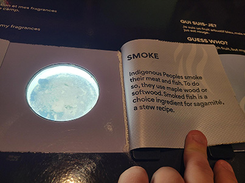
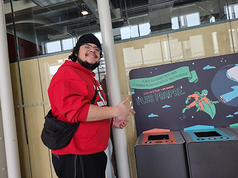

# Le Banquet: exposition au Centre des Sciences de Montréal

  

*Olivier, photo prise par moi*

 Visité le 31 janvier 2025, *Le Banquet* est une exposition qui a comme but de présenter la nourriture sous une autre forme. 

 L'exposition est pour tout les goûts, autant pour les petites qui veulent manger des bonbons, que pour les adultes pour sentir des odeurs agréables et pour les visuel immersif.

---

 ## Où et comment ?

 

  

*Efraïm et Moi, photo prise par Olivier*

L'exposition a été créé en 2024 et par *La Cité des Sciences et de l'Industrie en partenariat avec INRAE et Radio-Canada*. 
Le Centre des Sciences de Montréal se situe juste [ici](https://www.google.ca/maps/place/Centre+des+sciences+de+Montr%C3%A9al/@45.5047874,-73.5533179,17z/data=!3m1!4b1!4m6!3m5!1s0x4cc91af8afb32729:0xf341b1d10d346c12!8m2!3d45.5047874!4d-73.550743!16s%2Fm%2F047jd81?entry=ttu&g_ep=EgoyMDI1MDIxOC4wIKXMDSoASAFQAw%3D%3D)

---

## Les ingrédients du terroir Québecois avec un nouveau regard...et nez!

  

*dispositif multimédia, photo prise par moi*

Le Banquet est une exposition très intéressante, mais ce dispositif multimédia a plus capter mon attention que les autres.
*Les ingrédients du terroir Québecois avec un nouveau regard...et nez!* est un dispositif multimédia qui a comme concept de nous faire devinner des ingrédiants avec leurs odeurs.

Quand vous arrivez en face du dispositif vous voyez 6 qui suis-je de différantes couleurs.

  

*qui suis-je, photo prise par moi*

Dispositif utilisé:

Odeur | aliment
:-------------------------:|:-------------------------:
|

Voici un exeple de comment utiliser ce dispositif:

Sentir | Deviner
:-------------------------:|:-------------------------:
|

*Sentir et deviner, photos prisent par moi*

## Comment faire la mise en place ?

C'est très simple!

Il faut:

Des composanstes  fornies par L'artiste:
- Les ingrédiants
- Les caches odeurs/vision
- Un panneau explicatif

Des composantes fourni par la place:
- Une table
- Un écran
- des fils d'alimentations

## Expérience vécue

J'ai adoré ce dispositif! J'aime la façon qu'on intéragie avec le fait qu'on dois devinner avec son nez et ça nous a jouer des tours pour certain *Qui suis-je* sur la talbe.

J'ai aussi aimer en apprendre plus sur le terroir québecois et ce qui mangait avant et voir aussi qu'es-ce qui est resté dans nous habitude alimentaire. J'ai été content que l'artiste n'ai pas décidé de mettre des odeurs pas agréables pour nous montrer l'histoire, car tout au long de l'exposition notre nez était mit a l'épreuve et j'ai peur de encore sentir des odeurs qui peuvent me donner des nausées.

Personellement, j'aurai mis ce dispositif contre un mur faciliter la lecture de l'écrans au milieu et le texte explicatif de ce dispositif.

## Bonus

Ce que j'ai aimé du *Centre des Sciences* c'est leurs déssins pour tout les objets que nous utilisons dans nos vie quotidiennement comme sur des poubelles ou au toilettes. Ça donne un effet positif à ton regard sur tout. On a un effet de retomber en enfance et de voir des dessins de notre imagination partout!

Toilette | Poubelle
:-------------------------:|:-------------------------:
|

*Sentir et deviner, photos prisent par moi et Olivier*
