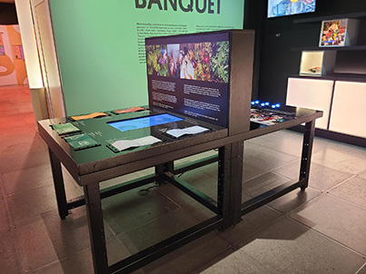
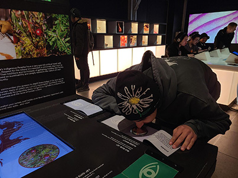
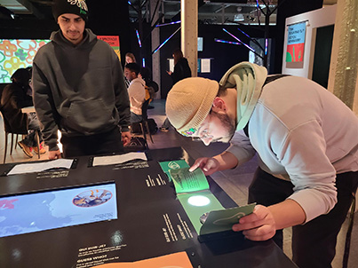

# Le Banquet: exposition au Centre des Sciences de Montréal

  

*Olivier, photo prise par moi

 Visité le 31 janvier 2025, *Le Banquet* est une exposition qui a comme but de présenter la nourriture sous une autre forme. 

 L'exposition est pour tout les goûts, autant pour les petites qui veulent manger des bonbons, que pour les adultes pour sentir des odeurs agréables et pour les visuel immersif.

---

 ## Où et comment ?

 

  

*Efraïm et Moi, photo prise par Olivier

L'exposition a été créé en 2024 et par *La Cité des Sciences et de l'Industrie en partenariat avec INRAE et Radio-Canada*. 
Le Centre des Sciences de Montréal se situe juste [ici](https://www.google.ca/maps/place/Centre+des+sciences+de+Montr%C3%A9al/@45.5047874,-73.5533179,17z/data=!3m1!4b1!4m6!3m5!1s0x4cc91af8afb32729:0xf341b1d10d346c12!8m2!3d45.5047874!4d-73.550743!16s%2Fm%2F047jd81?entry=ttu&g_ep=EgoyMDI1MDIxOC4wIKXMDSoASAFQAw%3D%3D)

---

## Les ingrédients du terroir Québecois avec un nouveau regard...et nez!

  

*dispositif multimédia, photo prise par moi

Le Banquet est une exposition très intéressante, mais ce dispositif multimédia a plus capter mon attention que les autres.
*Les ingrédients du terroir Québecois avec un nouveau regard...et nez!* est un dispositif multimédia qui a comme concept de nous faire devinner des ingrédiants avec leurs odeurs.

Quand vous arrivez en face du dispositif vous voyez 6 qui suis-je de différantes couleurs.

Sentir | Deviner
:-------------------------:|:-------------------------:
|

## Comment ça fonctionne ?

C'est très simple!

Il faut:

Des composanstes  fornies par L'artiste:
- Les ingrédiants
- Les caches odeurs/vision
- Un panneau explicatif

Des composantes fourni par la place:
- Une table
- Un écran
- des fils d'alimentations
