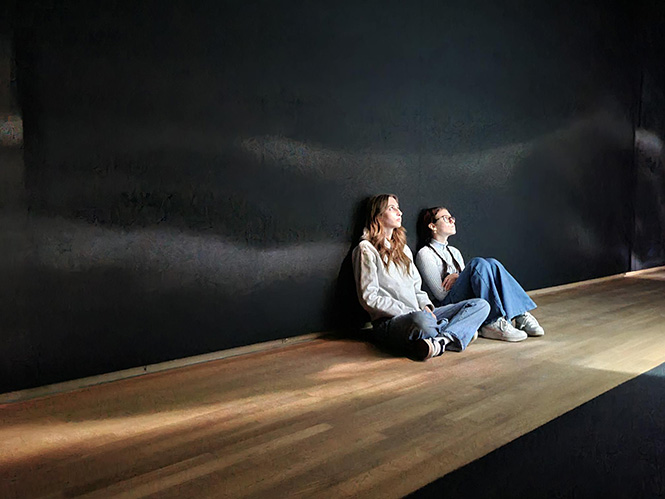
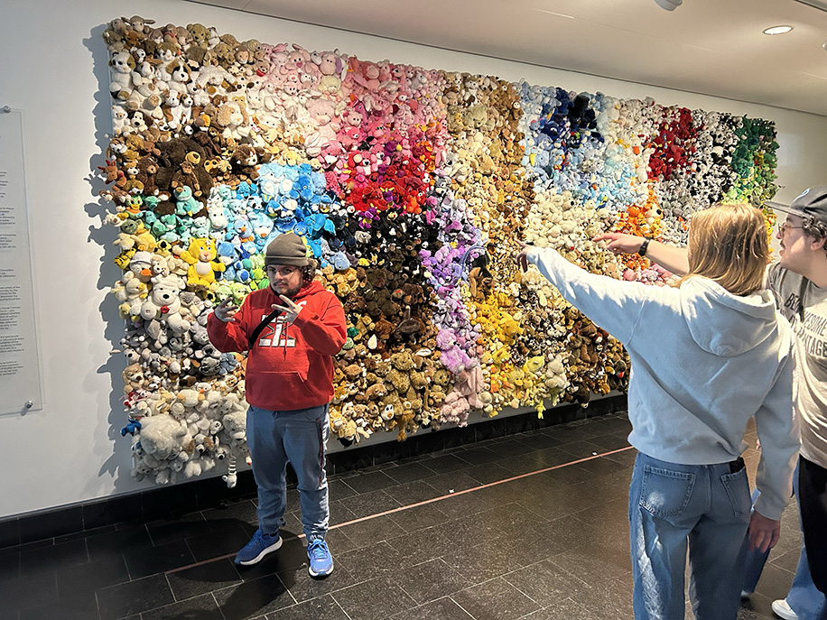
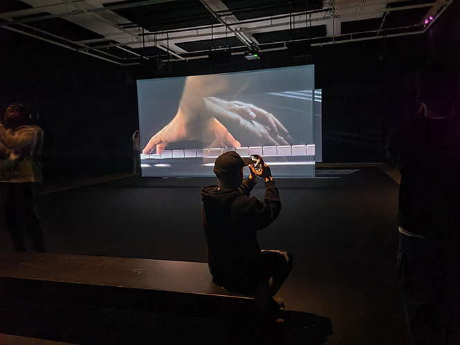
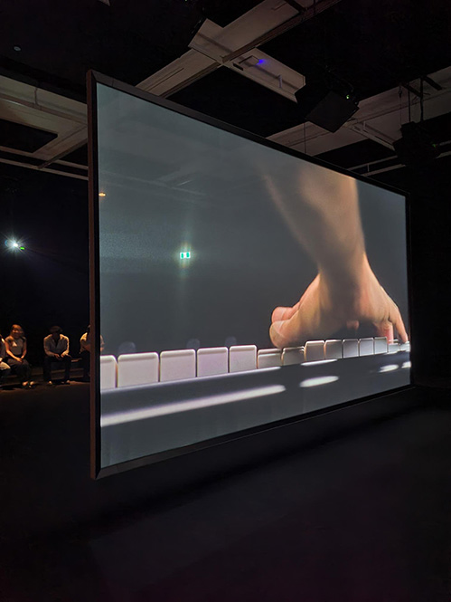
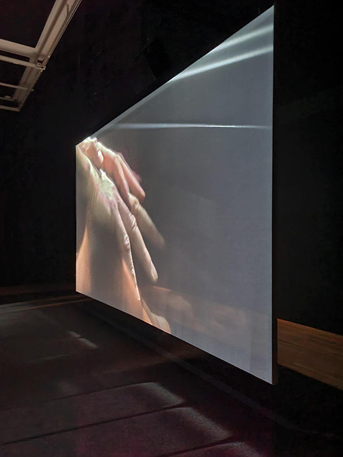
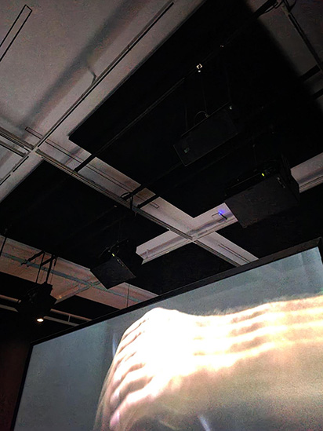
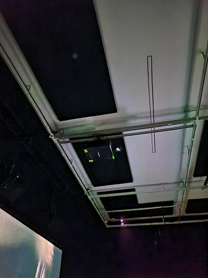
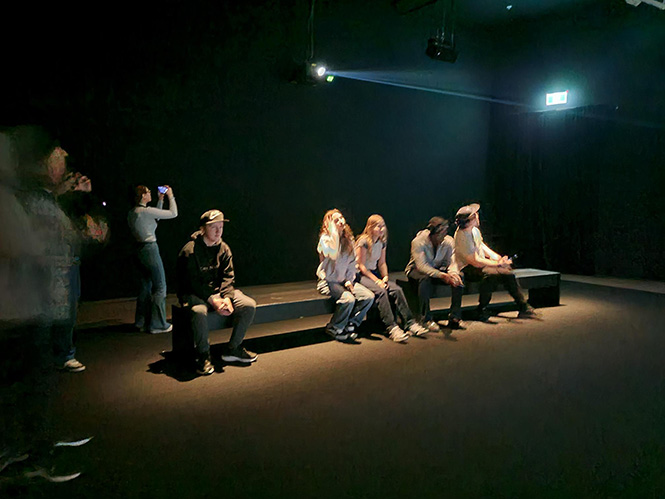

# VISITE ET EXPÉRIENCE D'UNE EXPOSITION ARTISTIQUE AU MUSÉE DES BEAUX-ARTS DE MONTRÉAL
### La visite a eu lieu le 4 avril 2025 au musée des beaux arts de montréal

   
  <i>Photo prise par moi</i>

   
  <i>Moi photo prise par Pablo</i>

 *[Site Internet](https://www.mbam.qc.ca/fr/expositions/anri-sala/)*
 
## Ravel Ravel Interval 

   
  <i>Vue ensemble photo prise par moi</i>

Dans ce dispositif en don au Musée par Pierre Bourgie, deux interprétations du Concerto pour la main gauche en ré majeur de Maurice Ravel (1875-1937) sont présentées en simultané.
Créée en 1929-1930, cette pièce musical est le résultat du pianiste Paul Wittgenstein après l’amputation de son bras droit lors de la Première Guerre mondiale.

Ce type d'installation est immersive. Le fait que la seul chose que vous entendez et regardez, c'est ce dispositif.

## Composantes

Il faut:

Des composanstes  fornies par L'artiste:
- La vidéo
- La musique

Des composantes fourni par la place:
- Les deux écrans
- les câbles d'alimentations
- Les hauts parleurs
- 14 projecteurs
- Les caches fils

## Mise en espace

Premier écran | Deuxième écran
:-------------------------:|:---------------------------:
|
Hauts parleurs | Projecteur
|

## Expérience vécue
Vue que la salle est presque vide et que la seul interaction est un banc. La plus part des gens s'assoient sur le banc et regarde les deux écrans superposé l'un sur l'autre. Le Concerto dur 20 minutes qui dans l'immersion parait comme un 5 minuites.

   
  <i>Banc photo prise par moi</i>

### Ce que j'ai le plus aimé: 
La musique et l'idée sont excellente. Tu sens la tristesse dans le morceau.

### Ce que j'ai le moins aimé:
Qu'il y ai qu'un seul long banc. Il manquait de place où s'assoir.

## Référence

   
  <i>Référence photo prise par moi</i>

